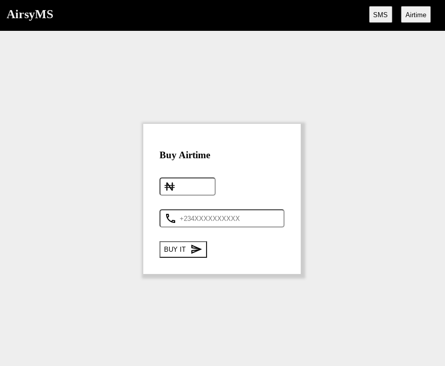

# AirsyMS

A codelab to build a simple application that can purchase airtime and send SMS with the Africa’s Talking APIs in the FSI Sandbox.

Live Demo: [https://airsyms.netlify.app/](https://airsyms.netlify.app/)
 
Complete Tutorial: [http://codelabs.fsi.ng/](http://codelabs.fsi.ng/)

   

### To Run/Test It Locally

1.  Clone this repo with and `cd` into the `at-sms-airtime-client-app-js` folder
2.  Run `npm install`
3.  Run `npm run dev`